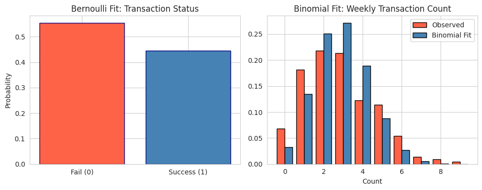
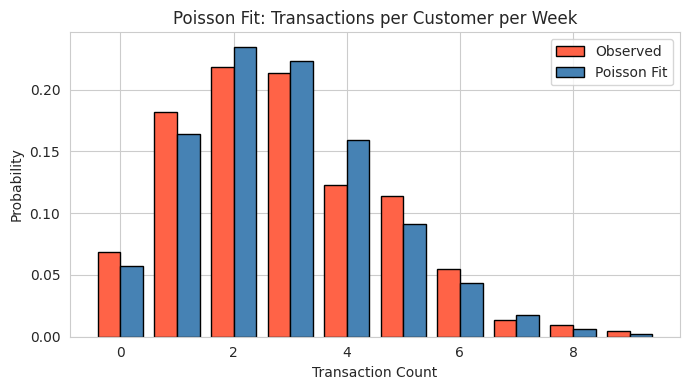
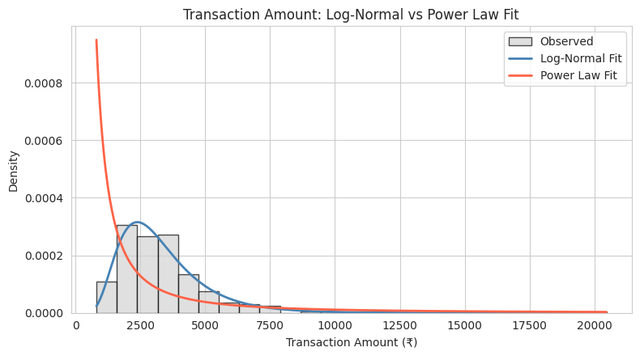
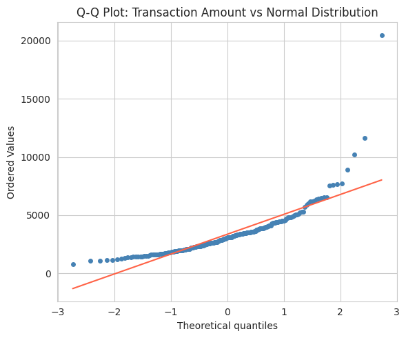
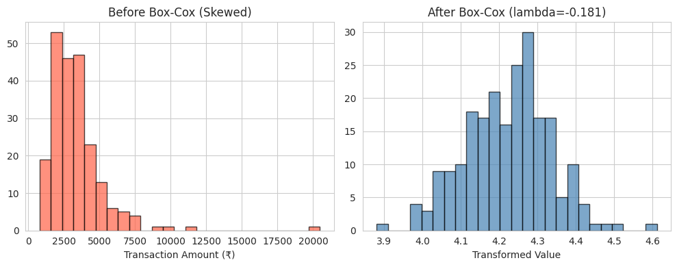
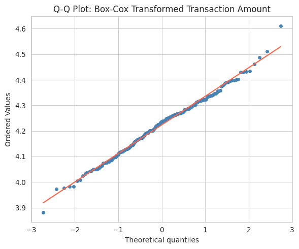
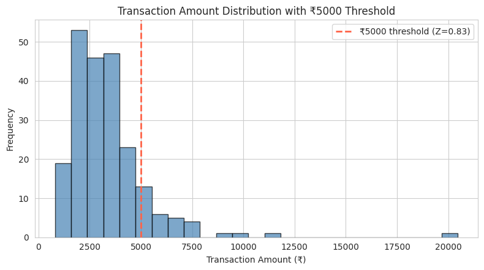
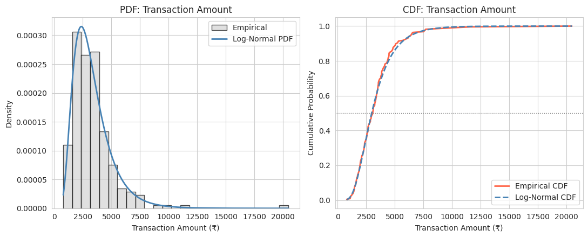

<p align="center">
  
</p>

<p align="center">
  
  
  
  
  
  
</p>

<p align="center">
  
  
  
</p>

<p align="center">
  <a href="https://github.com/Dhairyapatel1mc"></a>
  &nbsp;
  <a href="https://www.linkedin.com/in/ghost-patel-0267663b7/"></a>
  &nbsp;
  <a href="https://www.instagram.com/ghost_6927/?hl=en"></a>
</p>

---

---

<a name="toc"></a>
## 📌 Table of Contents

- <a name="project-overview"></a>[🎯 Project Overview](#-project-overview)
- <a name="project-objectives"></a>[🎯 Project Objectives](#-project-objectives)
- [🚀 Features](#-features)
- [📊 Dataset Attributes](#-dataset-attributes)
- [📁 Project Structure](#-project-structure)
- [🧠 Statistical Concepts Used](#-statistical-concepts-used)
- [🧰 Technologies Used](#-technologies-used)
- [⚙️ Installation](#️-installation)
- [▶️ How to Run](#️-how-to-run)
- [📈 Visualizations](#-visualizations)
- [📄 Sample Results](#-sample-results)
- [🎓 Learning Outcomes](#-learning-outcomes)
- [💡 Future Improvements](#-future-improvements)
- [👤 Author](#-author)
- [⭐ Support](#-support)
- [🏆 Final Conclusion](#-final-conclusion)

---

## <a id="-project-overview"></a>🎯 Project Overview

**PR. 3 — Spread Locator** is a two-part statistics project that analyzes daily e-commerce transaction data to understand *how the data is spread out* — its variability, shape, and underlying probability distribution.

Working as a data analyst for an e-commerce platform, the goal is to help management understand customer purchase behavior: are transactions random and independent? What's a "normal" transaction amount, and when should one be flagged as unusual? The project answers these questions using real statistical distributions rather than guesswork.

| Part | Focus |
|------|-------|
| **Part A** | Foundational descriptive statistics and measures of spread on the transaction dataset |
| **Part B** | Distribution fitting & hypothesis testing — Bernoulli, Binomial, Poisson, Log-Normal, Power Law, Q-Q plots, Box-Cox transform, Z-scores, PDF/CDF analysis |

> 🏫 Prepared for **Red & White Skill Education** — Mathematics & Advanced Statistics module.

**[⬆ Back to top](#toc)**

---

## <a id="-project-objectives"></a>🎯 Project Objectives

- Determine whether individual transactions behave like independent random events
- Model transaction success/failure and weekly transaction counts
- Identify the best-fitting distribution for transaction *amounts*
- Test the data for Normality and correct for skew where needed
- Quantify how unusual a specific transaction value is, using probability
- Present every finding with a supporting chart and a plain-English explanation

**[⬆ Back to top](#toc)**

---

## <a id="-features"></a>🚀 Features

- 📓 Two structured Jupyter notebooks (Part A & Part B), each broken into clearly numbered tasks
- 🧮 Six+ probability distributions fitted and statistically validated (KS tests, goodness-of-fit)
- 📊 8 exported chart images, so results can be viewed without opening Jupyter
- 🗣️ Every code cell is paired with a plain-English markdown explanation
- 📋 A final summary table consolidating every parameter and test result
- 🔁 Fully reproducible — a fixed random seed and clean, minimal plotting code throughout

**[⬆ Back to top](#toc)**

---

## <a id="-dataset-attributes"></a>📊 Dataset Attributes

| Column | Type | Description |
|--------|------|-------------|
| `date` | datetime | Date of the transaction |
| `transaction_status` | categorical | Success / Fail outcome of the transaction |
| `transaction_count` | integer | Number of transactions made by a customer in a week |
| `transaction_amount` | float (₹) | Value of the transaction |

**[⬆ Back to top](#toc)**

---

## <a id="-project-structure"></a>📁 Project Structure

```
.
├── README.md                          # You are here
├── spread_locator_Part_A.ipynb        # Part A — Descriptive statistics & spread analysis
├── spread_locator_Part_B.ipynb        # Part B — Distribution fitting & hypothesis testing
├── spread_locator_dataset.xls         # Source transaction dataset
└── charts/                            # Exported chart images (PNG) from Part B
    ├── 01_bernoulli_binomial_fit.png
    ├── 02_poisson_fit.png
    ├── 03_lognormal_vs_powerlaw_fit.png
    ├── 04_qq_plot_normal.png
    ├── 05_boxcox_before_after_histograms.png
    ├── 06_qq_plot_boxcox_transformed.png
    ├── 07_zscore_threshold.png
    └── 08_pdf_cdf_lognormal.png
```

**[⬆ Back to top](#toc)**

---

## <a id="-statistical-concepts-used"></a>🧠 Statistical Concepts Used

Each task in Part B builds on the last. Here's what the code is actually doing at each step:

**1. Bernoulli & Binomial Fit**
The code reads the `transaction_status` column and computes the proportion of successes — that proportion *is* the Bernoulli parameter `p`. It then reuses that same success logic across a fixed number of weekly attempts (`n_trials`) to build a Binomial model, comparing the model's predicted probabilities (`binom.pmf`) against the actual observed counts (`value_counts(normalize=True)`).

**2. Poisson Fit**
Since Poisson only needs one parameter, the code calculates `lambda` as the simple mean of `transaction_count`, then overlays `poisson.pmf(k, lambda)` against the same observed distribution used above, to see how well a single-parameter model captures the data.

**3. Log-Normal vs. Power Law**
`scipy.stats.lognorm.fit()` and `pareto.fit()` are run directly on `transaction_amount` — these functions use maximum likelihood estimation to find the parameters that make each distribution match the data as closely as possible. A **Kolmogorov–Smirnov (KS) test** then scores each fit; a higher p-value means the model can't be statistically distinguished from the real data.

**4. Q-Q Plot (Normality Check)**
`stats.probplot()` sorts the data and plots it against the values a true Normal distribution would produce at the same percentiles. Points hugging the diagonal reference line mean "close to Normal"; a curve away from it (especially at the tails) signals skew.

**5. Box-Cox Transform**
`scipy.stats.boxcox()` searches for the power transformation (`lambda`) that best reduces skew in `transaction_amount`. Skewness is measured with `scipy.stats.skew()` both before and after, to prove the transform worked numerically — not just visually.

**6. Z-Scores & Threshold Probability**
A Z-score is just `(value - mean) / std`. The code computes this for the ₹5,000 threshold, then compares two probabilities side-by-side: the **empirical** one (how many real transactions actually exceeded ₹5,000) versus the **theoretical** one predicted by the Normal distribution — exposing how far off a Normal assumption would be.

**7. PDF & CDF**
The fitted Log-Normal PDF (`lognorm.pdf`) is plotted against a density histogram of the real data, and the Log-Normal CDF (`lognorm.cdf`) is plotted against the empirical CDF (`np.arange(1, n+1) / n` on sorted data) — visually confirming the fit holds across the *entire* range, not just near the average.

**8. Summary Table**
The final cell doesn't calculate anything new — it just collects every parameter, p-value, and conclusion from Tasks 1–7 into a single Pandas DataFrame for a clean, at-a-glance comparison.

**[⬆ Back to top](#toc)**

---

## <a id="-technologies-used"></a>🧰 Technologies Used

<div align="center">


</div>

**[⬆ Back to top](#toc)**

---

## <a id="-installation"></a>⚙️ Installation

```bash
# Clone the repository
git clone https://github.com/Dhairyapatel1mc/PR.-3-Spread-Locator-Mathematics-Advanced-Statistics-.git
cd PR.-3-Spread-Locator-Mathematics-Advanced-Statistics-

# Install dependencies
pip install numpy pandas matplotlib seaborn scipy jupyter
```

**[⬆ Back to top](#toc)**

---

## <a id="-how-to-run"></a>▶️ How to Run

1. Make sure `spread_locator_dataset.xls` is in the project folder (update the file path in the notebook if you move it).
2. Launch Jupyter:
   ```bash
   jupyter notebook
   ```
3. Open `spread_locator_Part_A.ipynb` first, then `spread_locator_Part_B.ipynb`.
4. Run all cells in order (**Cell → Run All**). Each task builds on variables from the previous one, so cells should not be skipped.

**[⬆ Back to top](#toc)**

---

## <a id="-visualizations"></a>📈 Visualizations

| | |
|---|---|
|  |  |
|  |  |
|  |  |
|  |  |

**[⬆ Back to top](#toc)**

---

## <a id="-sample-results"></a>📄 Sample Results

| Distribution | Fitted Parameters | Goodness-of-Fit | Verdict |
|---|---|---|---|
| Bernoulli | p ≈ observed success rate | — | Baseline model |
| Binomial | n_trials, p_binom | Visual match to observed counts | Reasonable fit |
| Poisson | λ ≈ mean(transaction_count) | Compared to observed counts | Reasonable fit |
| Log-Normal | shape, loc, scale | KS p ≈ 0.90 | ✅ Best fit |
| Power Law | b, loc, scale | KS p ≈ low | ❌ Rejected |
| Normal (Q-Q) | — | Right-skew visible in tail | ❌ Not Normal |
| Box-Cox | λ (optimal) | Skew reduced toward 0 | ✅ Effective |

**[⬆ Back to top](#toc)**

---

## <a id="-learning-outcomes"></a>🎓 Learning Outcomes

- How to choose between discrete distributions (Bernoulli, Binomial, Poisson) based on what the data represents
- How to fit continuous distributions using maximum likelihood estimation with SciPy
- How to statistically validate a distribution fit using the KS test, not just eyeball it
- How to diagnose non-Normality with a Q-Q plot and correct it with a Box-Cox transform
- How to turn a raw value into a probability statement using Z-scores
- How to communicate statistical findings clearly, pairing every result with a plain-English explanation

**[⬆ Back to top](#toc)**

---

## <a id="-future-improvements"></a>💡 Future Improvements

- Add confidence intervals around each fitted distribution's parameters
- Automate distribution selection using `scipy.stats` best-fit search across multiple candidates
- Build an interactive dashboard (e.g. Streamlit) so thresholds can be adjusted live
- Extend the anomaly detection in Task 6 into a full outlier-flagging pipeline
- Add unit tests for the data-loading and transformation functions

**[⬆ Back to top](#toc)**

---

## <a id="-author"></a>👤 Author

<p align="center">
  <a href="https://github.com/Dhairyapatel1mc"></a>
  &nbsp;
  <a href="https://www.linkedin.com/in/ghost-patel-0267663b7/"></a>
  &nbsp;
  <a href="https://www.instagram.com/ghost_6927/?hl=en"></a>
</p>

**[⬆ Back to top](#toc)**

---

## <a id="-support"></a>⭐ Support

If this project helped you understand distribution fitting or hypothesis testing, consider giving it a ⭐ on GitHub — it helps others find it too.

**[⬆ Back to top](#toc)**

---

## <a id="-final-conclusion"></a>🏆 Final Conclusion

Transaction amounts on this platform are best modeled by a **Log-Normal distribution** — the KS test fails to reject it (p ≈ 0.90), and it closely tracks both the empirical PDF and CDF, including the right tail. The **Power Law** fit is firmly rejected. The Q-Q plot confirms the raw data is **not Normally distributed** (right-skewed), so any downstream model assuming Normality should first apply the **Box-Cox transformation**, which substantially reduces that skew.

**[⬆ Back to top](#toc)**

---

<div align="center">


</div>
